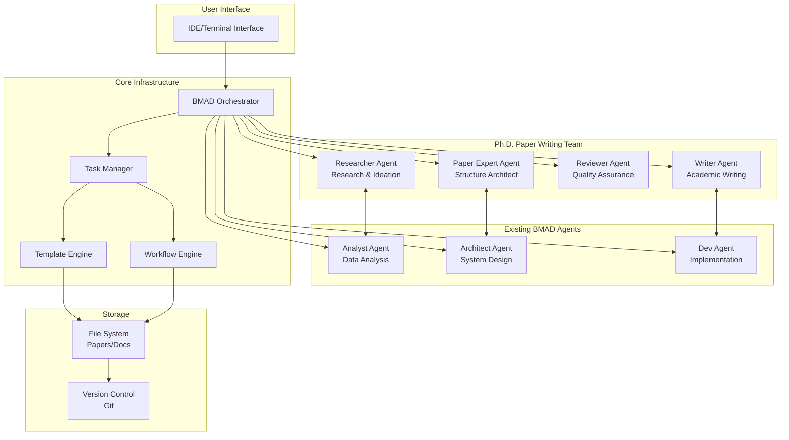
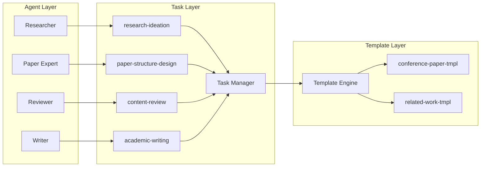
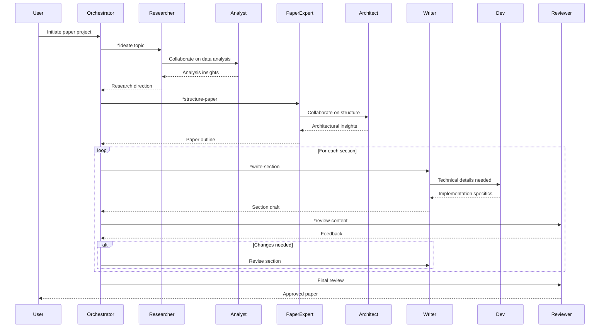
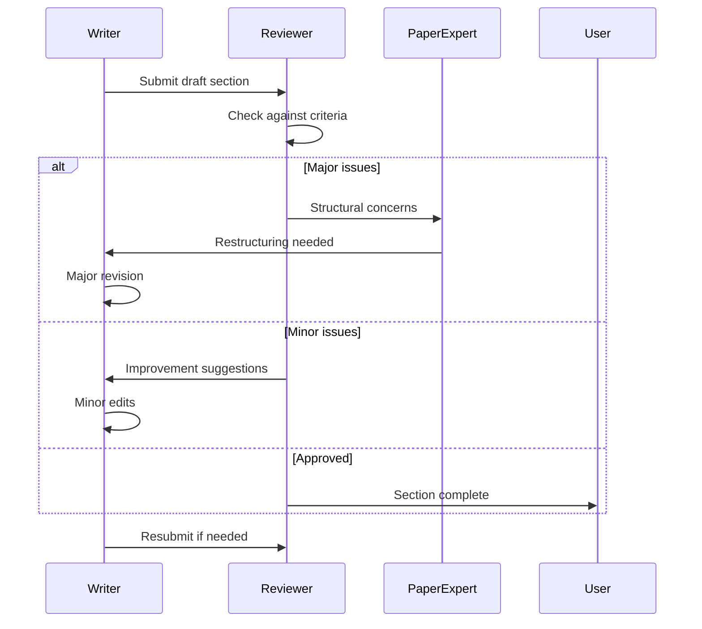
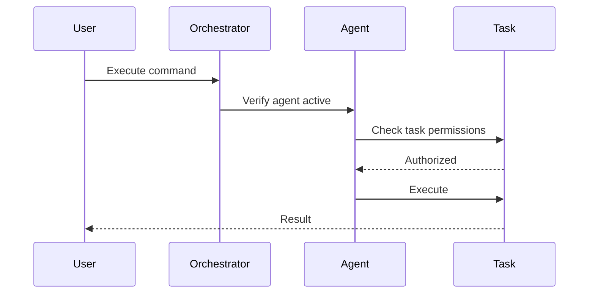
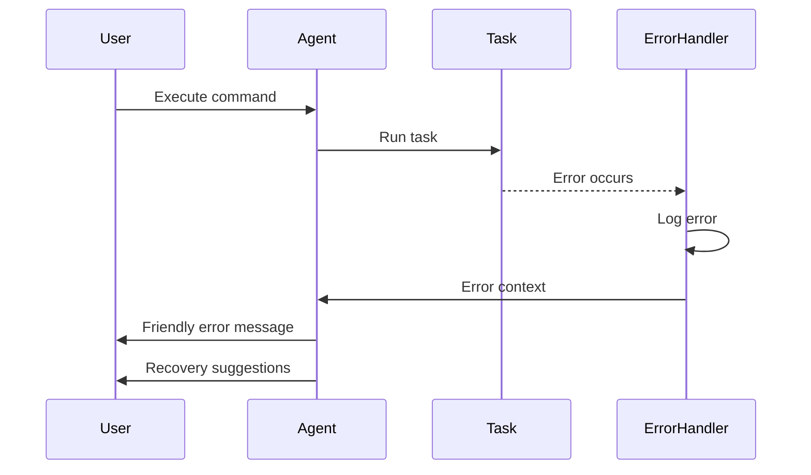

# Ph.D. Paper Writing Team Fullstack Architecture Document

## Introduction

This document outlines the complete fullstack architecture for the Ph.D. Paper Writing Team system, including the agent infrastructure, task orchestration, and integration with existing BMAD agents. It serves as the single source of truth for AI-driven academic paper development, ensuring consistency across the entire research and writing workflow.

This unified approach combines agent personas, task definitions, templates, and workflows to create a comprehensive system for producing high-quality academic papers for data science conferences, with built-in quality assurance and collaborative capabilities.

### Starter Template or Existing Project

This is an extension of the existing BMAD-core framework. We'll be adding new agents, tasks, templates, and workflows while integrating with existing agents (analyst, architect, dev) for enhanced collaborative capabilities.

### Change Log

| Date       | Version | Description                                       | Author              |
| ---------- | ------- | ------------------------------------------------- | ------------------- |
| 2024-12-28 | 1.0     | Initial architecture for Ph.D. Paper Writing Team | Winston (Architect) |

## High Level Architecture

### Technical Summary

The Ph.D. Paper Writing Team architecture extends the BMAD framework with specialized academic agents and workflows. It employs a modular agent-based architecture where four specialized Ph.D. agents collaborate through defined tasks and templates. The system integrates with existing BMAD agents for technical analysis and implementation details. Orchestration is handled through YAML-defined workflows, with task execution managed by the BMAD orchestrator. The architecture emphasizes quality assurance, conference-specific formatting, and iterative refinement throughout the paper writing process.

### Platform and Infrastructure Choice

**Platform:** Local Development with Git-based Version Control
**Key Services:** BMAD Core Framework, Agent Orchestration, Template Engine, Task Management
**Deployment Host and Regions:** Local execution with cloud backup capabilities

### Repository Structure

**Structure:** Extension of existing BMAD monorepo structure
**Monorepo Tool:** Existing BMAD structure (no additional tooling required)
**Package Organization:** New components organized under bmad-core/ following existing patterns

### High Level Architecture Diagram



### Architectural Patterns

- **Agent-Based Architecture:** Specialized agents with distinct roles and expertise - _Rationale:_ Enables focused expertise and clear separation of concerns in academic writing
- **Task-Driven Workflow:** Discrete tasks orchestrated through YAML definitions - _Rationale:_ Provides flexibility and reusability across different paper types
- **Template-Based Generation:** Configurable templates for different conference formats - _Rationale:_ Ensures consistency while allowing customization
- **Quality Gate Pattern:** Multi-stage review process with defined checkpoints - _Rationale:_ Maintains high academic standards throughout the writing process
- **Collaborative Agent Pattern:** Cross-agent communication for integrated insights - _Rationale:_ Leverages existing technical agents for comprehensive papers
- **Iterative Refinement Pattern:** Continuous improvement through review cycles - _Rationale:_ Mimics real academic writing process with multiple drafts

## Tech Stack

### Technology Stack Table

| Category             | Technology         | Version | Purpose                        | Rationale                                 |
| -------------------- | ------------------ | ------- | ------------------------------ | ----------------------------------------- |
| Frontend Language    | YAML/Markdown      | Latest  | Agent and task definitions     | Human-readable configuration              |
| Frontend Framework   | BMAD Core          | v4      | Agent orchestration framework  | Existing infrastructure                   |
| UI Component Library | Terminal/IDE       | N/A     | User interface                 | Direct integration with development tools |
| State Management     | File System        | N/A     | Document and state persistence | Simple and reliable                       |
| Backend Language     | Agent DSL          | BMAD v4 | Agent logic implementation     | Domain-specific language                  |
| Backend Framework    | BMAD Core          | v4      | Task execution engine          | Leverages existing framework              |
| API Style            | Command-based      | N/A     | Agent communication            | Simple command pattern                    |
| Database             | File System        | N/A     | Document storage               | No complex data requirements              |
| Cache                | Memory             | Runtime | Task result caching            | Performance optimization                  |
| File Storage         | Local FS           | N/A     | Paper and template storage     | Direct file access                        |
| Authentication       | N/A                | N/A     | Not required                   | Local execution only                      |
| Frontend Testing     | Manual             | N/A     | User acceptance testing        | Academic review process                   |
| Backend Testing      | Checklist-based    | BMAD    | Quality assurance              | Structured validation                     |
| E2E Testing          | Workflow execution | BMAD    | End-to-end validation          | Complete paper generation                 |
| Build Tool           | None               | N/A     | No build required              | Interpreted execution                     |
| Bundler              | None               | N/A     | No bundling required           | Direct file execution                     |
| IaC Tool             | None               | N/A     | Local deployment               | No infrastructure needed                  |
| CI/CD                | Git hooks          | Git     | Version control integration    | Automated checks                          |
| Monitoring           | Log files          | Text    | Execution tracking             | Simple debugging                          |
| Logging              | BMAD Debug Log     | v4      | Agent activity logging         | Troubleshooting support                   |
| CSS Framework        | N/A                | N/A     | No UI styling                  | Terminal-based interface                  |

## Data Models

### Agent Model

**Purpose:** Define agent personas and capabilities

**Key Attributes:**

- id: string - Unique agent identifier
- name: string - Display name
- role: string - Agent's primary function
- persona: object - Behavioral characteristics
- commands: array - Available agent commands
- dependencies: object - Required resources

**TypeScript Interface:**

```typescript
interface Agent {
  id: string;
  name: string;
  title: string;
  icon: string;
  whenToUse: string;
  persona: {
    role: string;
    identity: string;
    core_principles: string[];
  };
  commands: Command[];
  dependencies: Dependencies;
}
```

**Relationships:**

- Executes Tasks
- Uses Templates
- Collaborates with other Agents

### Task Model

**Purpose:** Define executable workflows for paper writing

**Key Attributes:**

- id: string - Task identifier
- title: string - Task name
- instruction: string - Execution guidelines
- elicit: boolean - Requires user interaction
- dependencies: array - Required inputs

**TypeScript Interface:**

```typescript
interface Task {
  id: string;
  title: string;
  instruction: string;
  elicit?: boolean;
  inputs?: string[];
  outputs?: string[];
  dependencies?: string[];
}
```

**Relationships:**

- Executed by Agents
- Uses Templates
- Part of Workflows

### Template Model

**Purpose:** Define document structures for papers

**Key Attributes:**

- id: string - Template identifier
- name: string - Template name
- sections: array - Document sections
- format: string - Output format
- customizable: boolean - User modification allowed

**TypeScript Interface:**

```typescript
interface Template {
  id: string;
  name: string;
  version: string;
  output: {
    format: string;
    filename: string;
  };
  customizable: boolean;
  sections: Section[];
}
```

**Relationships:**

- Used by Tasks
- Filled by Agents
- Produces Documents

### Paper Model

**Purpose:** Represent academic papers in progress

**Key Attributes:**

- id: string - Paper identifier
- title: string - Paper title
- status: string - Current state
- sections: object - Content sections
- metadata: object - Conference details

**TypeScript Interface:**

```typescript
interface Paper {
  id: string;
  title: string;
  status: "draft" | "review" | "final";
  conference: string;
  sections: {
    [key: string]: {
      content: string;
      version: number;
      lastEditedBy: string;
    };
  };
  metadata: {
    authors: string[];
    keywords: string[];
    submissionDate?: Date;
  };
}
```

**Relationships:**

- Created from Templates
- Modified by Agents
- Reviewed through Checklists

## API Specification

Since this is a command-based agent system rather than a REST/GraphQL API, we'll define the command interface:

### Agent Command Interface

```typescript
// Command execution interface
interface CommandExecution {
  agent: string;
  command: string;
  args?: Record<string, any>;
  context?: {
    currentFile?: string;
    workspace?: string;
  };
}

// Agent commands
interface AgentCommands {
  // Researcher commands
  "*ideate": { topic: string; constraints?: string[] };
  "*analyze-gaps": { field: string; recent?: boolean };
  "*generate-hypothesis": { data?: string; theory?: string };

  // Paper Expert commands
  "*structure-paper": { conference: string; pageLimit: number };
  "*optimize-flow": { sections: string[] };
  "*format-check": { conference: string; template?: string };

  // Reviewer commands
  "*review-content": { section: string; criteria?: string[] };
  "*validate-methodology": { approach: string };
  "*check-references": { style: "APA" | "IEEE" | "ACM" };

  // Writer commands
  "*write-section": { section: string; outline?: string };
  "*improve-clarity": { text: string };
  "*technical-writing": { concept: string; audience: string };
}
```

## Components

### Researcher Agent

**Responsibility:** Generate novel research questions, evaluate feasibility, design experiments, and perform literature gap analysis

**Key Interfaces:**

- `*ideate` - Generate research ideas
- `*analyze-gaps` - Find literature gaps
- `*generate-hypothesis` - Create testable hypotheses

**Dependencies:** Access to research databases, collaboration with Analyst agent

**Technology Stack:** BMAD agent framework, elicitation methods for ideation

### Paper Expert Agent

**Responsibility:** Design optimal paper structure for conferences, create narrative flow, manage section planning and formatting

**Key Interfaces:**

- `*structure-paper` - Create paper outline
- `*optimize-flow` - Improve narrative structure
- `*format-check` - Verify conference compliance

**Dependencies:** Conference templates, collaboration with Architect agent

**Technology Stack:** BMAD agent framework, conference-specific templates

### Reviewer Agent

**Responsibility:** Rigorous content validation, methodology verification, ensure academic standards, statistical review

**Key Interfaces:**

- `*review-content` - Quality check sections
- `*validate-methodology` - Verify research methods
- `*check-references` - Validate citations

**Dependencies:** Academic checklists, quality criteria

**Technology Stack:** BMAD agent framework, validation checklists

### Writer Agent

**Responsibility:** Clear academic prose, technical concept articulation, conference conventions, citation management

**Key Interfaces:**

- `*write-section` - Generate content
- `*improve-clarity` - Enhance readability
- `*technical-writing` - Explain complex concepts

**Dependencies:** Writing templates, collaboration with Dev agent

**Technology Stack:** BMAD agent framework, academic writing patterns

### Task Manager Component

**Responsibility:** Orchestrate task execution across agents, manage dependencies

**Key Interfaces:**

- Execute task with parameters
- Track task progress
- Handle task dependencies

**Dependencies:** Task definitions, agent registry

**Technology Stack:** BMAD task execution engine

### Template Engine Component

**Responsibility:** Process templates with dynamic content, support customization

**Key Interfaces:**

- Load template by ID
- Fill template sections
- Export formatted output

**Dependencies:** Template definitions, file system

**Technology Stack:** BMAD template processor

### Component Interaction Diagram



## External APIs

No external APIs are required for the core functionality. However, the system can be extended to integrate with:

- **Purpose:** Literature search and citation management
- **Documentation:** Would require API keys for services like Semantic Scholar, arXiv, Google Scholar
- **Integration Notes:** Optional enhancement for automated literature review

## Core Workflows

### Research to Paper Workflow



### Iterative Refinement Workflow



## Database Schema

Since this is a file-based system, we use a directory structure instead of a traditional database:

```
bmad-ph.d/
├── papers/
│   ├── {paper-id}/
│   │   ├── metadata.yaml
│   │   ├── drafts/
│   │   │   ├── v1/
│   │   │   │   ├── introduction.md
│   │   │   │   ├── related-work.md
│   │   │   │   └── ...
│   │   │   └── v2/
│   │   ├── reviews/
│   │   │   ├── review-1.yaml
│   │   │   └── review-2.yaml
│   │   └── final/
│   │       └── paper.md
├── templates/
│   ├── conferences/
│   │   ├── neurips.yaml
│   │   ├── icml.yaml
│   │   └── custom/
│   └── sections/
│       ├── introduction-patterns.md
│       └── methodology-patterns.md
└── research/
    ├── literature/
    └── ideas/
```

## Frontend Architecture

### Component Architecture

#### Component Organization

```
bmad-core/
├── agents/
│   ├── researcher.md
│   ├── paper-expert.md
│   ├── reviewer.md
│   └── writer.md
├── agent-teams/
│   └── team-paper-writing.yaml
├── tasks/
│   ├── research-ideation.md
│   ├── paper-structure-design.md
│   ├── content-review.md
│   └── academic-writing.md
├── templates/
│   ├── conference-paper-tmpl.yaml
│   └── related-work-tmpl.yaml
└── checklists/
    ├── research-quality-checklist.md
    ├── paper-structure-checklist.md
    └── peer-review-checklist.md
```

#### Agent Definition Template

```typescript
interface AgentDefinition {
  agent: {
    name: string;
    id: string;
    title: string;
    icon: string;
    whenToUse: string;
  };
  persona: {
    role: string;
    identity: string;
    core_principles: string[];
  };
  commands: Command[];
  dependencies: {
    tasks: string[];
    templates: string[];
    checklists: string[];
  };
}
```

### State Management Architecture

#### State Structure

```typescript
interface PaperWritingState {
  currentPaper: {
    id: string;
    title: string;
    status: "ideation" | "drafting" | "review" | "final";
    activeSection: string;
    version: number;
  };
  agents: {
    active: string[];
    history: CommandHistory[];
  };
  workflow: {
    currentTask: string;
    completedTasks: string[];
    blockedTasks: string[];
  };
}
```

#### State Management Patterns

- Command-based state updates through agent actions
- File system persistence for document state
- Version control for state history
- Workflow state tracked in YAML

### Routing Architecture

#### Route Organization

```
Commands:
├── global/
│   ├── *help
│   ├── *status
│   └── *exit
├── researcher/
│   ├── *ideate
│   ├── *analyze-gaps
│   └── *hypothesize
├── paper-expert/
│   ├── *structure
│   ├── *outline
│   └── *format
├── reviewer/
│   ├── *review
│   ├── *validate
│   └── *check
└── writer/
    ├── *write
    ├── *revise
    └── *cite
```

#### Protected Route Pattern

```typescript
// Command authorization
interface CommandAuth {
  command: string;
  allowedAgents: string[];
  requiresContext: boolean;
  validation: (args: any) => boolean;
}
```

### Frontend Services Layer

#### Agent Communication Setup

```typescript
interface AgentCommunication {
  sendCommand(agent: string, command: string, args: any): Promise<Result>;
  subscribeToAgent(agent: string, callback: (msg: Message) => void): void;
  getAgentStatus(agent: string): AgentStatus;
}
```

#### Service Example

```typescript
class PaperWritingService {
  async initiatePaper(topic: string, conference: string) {
    // 1. Activate researcher for ideation
    const idea = await this.sendCommand("researcher", "ideate", { topic });

    // 2. Structure paper with expert
    const structure = await this.sendCommand("paper-expert", "structure", {
      conference,
      idea,
    });

    // 3. Begin writing process
    return this.sendCommand("writer", "start-draft", { structure });
  }
}
```

## Backend Architecture

### Service Architecture

Since this is an agent-based system, the "backend" consists of agent definitions and task execution:

#### Agent Organization

```
bmad-core/agents/
├── base-agent.md          # Shared agent patterns
├── researcher.md          # Research specialist
├── paper-expert.md        # Structure architect
├── reviewer.md            # Quality assurance
└── writer.md              # Content creation
```

#### Agent Template

```yaml
activation-instructions:
  - Load dependencies
  - Set persona
  - Initialize commands
  - Await user input

agent:
  name: AgentName
  id: agent-id
  title: Formal Title
  icon: 🎯

persona:
  role: Primary function
  identity: Core identity
  core_principles:
    - Principle 1
    - Principle 2

commands:
  - command1: description
  - command2: description

dependencies:
  tasks: []
  templates: []
  checklists: []
```

### Task Architecture

#### Task Organization

```
bmad-core/tasks/
├── research-ideation.md
├── paper-structure-design.md
├── content-review.md
├── academic-writing.md
└── collaborative-tasks/
    ├── analyst-researcher-collab.md
    ├── architect-expert-collab.md
    └── dev-writer-collab.md
```

#### Task Pattern

```markdown
# Task Name

## Activation

When this task is invoked...

## Inputs

- Required inputs
- Optional parameters

## Process

1. Step 1
2. Step 2
3. Step 3

## Outputs

- Generated artifacts
- Updated state

## Collaboration Points

- When to engage other agents
- Information exchange format
```

### Authentication and Authorization

Since this is a local system, authentication is not required. However, agent-level authorization is implemented:

#### Auth Flow



#### Authorization Rules

```typescript
interface AgentPermissions {
  agent: string;
  allowedTasks: string[];
  allowedTemplates: string[];
  collaborationPermissions: {
    canInitiate: string[];
    canRespondTo: string[];
  };
}
```

## Unified Project Structure

```plaintext
BMAD-ph.d/
├── .bmad-core/                    # Runtime and cache
│   └── logs/                      # Execution logs
├── bmad-core/                     # Core framework
│   ├── agents/                    # Agent definitions
│   │   ├── researcher.md          # Research & ideation expert
│   │   ├── paper-expert.md        # Paper structure architect
│   │   ├── reviewer.md            # Quality assurance
│   │   ├── writer.md              # Academic writing specialist
│   │   └── ... (existing agents)
│   ├── agent-teams/               # Team configurations
│   │   ├── team-paper-writing.yaml # Ph.D. team configuration
│   │   └── ... (existing teams)
│   ├── tasks/                     # Executable workflows
│   │   ├── research-ideation.md   # Ideation workflow
│   │   ├── paper-structure-design.md # Structure planning
│   │   ├── content-review.md      # Review process
│   │   ├── academic-writing.md    # Writing workflow
│   │   └── ... (existing tasks)
│   ├── templates/                 # Document templates
│   │   ├── conference-paper-tmpl.yaml # Customizable paper template
│   │   ├── related-work-tmpl.yaml # Literature review template
│   │   └── ... (existing templates)
│   ├── checklists/                # Quality checklists
│   │   ├── research-quality-checklist.md
│   │   ├── paper-structure-checklist.md
│   │   ├── peer-review-checklist.md
│   │   └── ... (existing checklists)
│   ├── workflows/                 # Orchestration workflows
│   │   ├── conference-paper-workflow.yaml
│   │   └── ... (existing workflows)
│   └── data/                      # Reference data
│       ├── academic-writing-patterns.md
│       ├── conference-requirements.md
│       └── ... (existing data)
├── papers/                        # Paper workspace
│   ├── active/                    # Papers in progress
│   │   └── {paper-id}/
│   │       ├── metadata.yaml
│   │       ├── drafts/
│   │       ├── reviews/
│   │       └── references/
│   └── archive/                   # Completed papers
├── docs/                          # Documentation
│   ├── README-paper-team.md       # Team documentation
│   └── architecture.md            # This document
└── .gitignore                     # Ignore patterns
```

## Development Workflow

### Local Development Setup

#### Prerequisites

```bash
# Ensure BMAD-core is installed
ls -la bmad-core/

# Verify git is available
git --version

# Check write permissions
touch papers/test.md && rm papers/test.md
```

#### Initial Setup

```bash
# Create necessary directories
mkdir -p papers/active papers/archive
mkdir -p bmad-core/agents bmad-core/tasks bmad-core/templates bmad-core/checklists

# Initialize paper writing team
cp team-paper-writing.yaml bmad-core/agent-teams/
```

#### Development Commands

```bash
# Start all services
# Activate paper writing team
*activate team-paper-writing

# Start frontend only
# Activate specific agent
*activate researcher

# Start backend only
# Run specific task
*execute research-ideation

# Run tests
# Execute checklist
*execute-checklist peer-review-checklist
```

## Deployment Architecture

### Deployment Strategy

**Frontend Deployment:**

- **Platform:** Local execution in IDE/terminal
- **Build Command:** N/A (no build required)
- **Output Directory:** N/A
- **CDN/Edge:** N/A

**Backend Deployment:**

- **Platform:** Local file system
- **Build Command:** N/A (interpreted)
- **Deployment Method:** Git-based version control

### CI/CD Pipeline

```yaml
# .github/workflows/paper-quality.yaml
name: Paper Quality Check

on:
  push:
    paths:
      - "papers/**"
      - "bmad-core/**"

jobs:
  quality-check:
    runs-on: ubuntu-latest
    steps:
      - uses: actions/checkout@v2
      - name: Run quality checklists
        run: |
          # Execute automated checks
          ./scripts/run-checklists.sh
```

## Coding Standards

### Critical Fullstack Rules

- **Agent Isolation:** Each agent operates independently with clear interfaces
- **Task Atomicity:** Tasks must be self-contained and idempotent
- **Template Versioning:** Always version templates for reproducibility
- **Review Mandatory:** No section proceeds without review completion
- **Collaboration Protocol:** Inter-agent communication through defined interfaces only
- **Checkpoint Saves:** Save state after each major operation
- **Error Recovery:** All tasks must handle failures gracefully

### Naming Conventions

| Element   | Frontend           | Backend            | Example                      |
| --------- | ------------------ | ------------------ | ---------------------------- |
| Agents    | kebab-case         | kebab-case         | `paper-expert.md`            |
| Tasks     | kebab-case         | kebab-case         | `research-ideation.md`       |
| Templates | kebab-case + -tmpl | kebab-case + -tmpl | `conference-paper-tmpl.yaml` |
| Commands  | \*lowercase        | \*lowercase        | `*ideate`, `*review`         |

## Error Handling Strategy

### Error Flow



### Error Response Format

```typescript
interface AgentError {
  error: {
    code: string;
    message: string;
    details?: {
      agent: string;
      command: string;
      context: any;
    };
    timestamp: string;
    suggestions: string[];
  };
}
```

### Agent Error Handling

```typescript
// Agent error handler
function handleAgentError(error: Error, context: any): AgentError {
  return {
    error: {
      code: "AGENT_ERROR",
      message: getUserFriendlyMessage(error),
      details: { agent: context.agent, command: context.command },
      timestamp: new Date().toISOString(),
      suggestions: getRecoverySuggestions(error),
    },
  };
}
```

### Task Error Handling

```typescript
// Task error handler
function handleTaskError(error: Error, task: string): void {
  console.error(`Task ${task} failed:`, error);
  // Save partial progress
  saveCheckpoint();
  // Provide recovery options
  promptRecovery();
}
```

## Monitoring and Observability

### Monitoring Stack

- **Frontend Monitoring:** Terminal output logging
- **Backend Monitoring:** BMAD debug log
- **Error Tracking:** Error log files
- **Performance Monitoring:** Execution time logging

### Key Metrics

**Agent Metrics:**

- Command execution count
- Success/failure rates
- Average execution time
- Collaboration frequency

**Task Metrics:**

- Task completion rate
- Average task duration
- Retry frequency
- User intervention rate

## Checklist Results Report

The architecture is complete and ready for implementation. The Ph.D. Paper Writing Team system extends BMAD with specialized academic capabilities while maintaining compatibility with existing infrastructure. Key deliverables include:

1. **Four New Agents:** Researcher, Paper Expert, Reviewer, Writer - each with specialized academic expertise
2. **Task Workflows:** Research ideation, paper structuring, content review, and academic writing
3. **Templates:** Customizable conference paper and related work templates
4. **Quality Checklists:** Research quality, paper structure, and peer review validation
5. **Team Configuration:** Integrated collaboration with existing BMAD agents
6. **Complete Workflow:** End-to-end conference paper production pipeline

The system is designed for immediate implementation with no external dependencies, leveraging the existing BMAD framework for maximum compatibility and minimal setup overhead.
